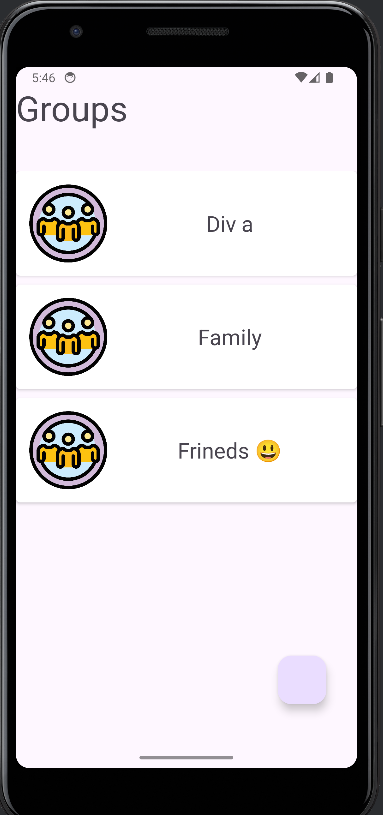
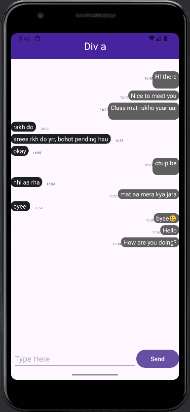

# Ano Chat
Ano Chat is an anonymous chat application built for Android that allows users to connect instantly without the need for personal sign-ups or accounts. Using Firebase Anonymous Authentication and Realtime Database, users can create chat groups and communicate in real-time. Upon downloading the app, users are automatically added to all existing groups, fostering a seamless and open chat experience.

This project is designed to demonstrate real-time communication and anonymous user interaction in a simple, user-friendly interface.

---

## Features
- **Anonymous Access**: No sign-up required—users are authenticated anonymously via Firebase.
- **Group Creation**: Create new chat groups with ease.
- **Auto-Join Groups**: All users are automatically added to every existing group upon joining.
- **Real-Time Messaging**: Chat instantly with others using Firebase Realtime Database.
- **Simple UI**: Minimalistic design focused on functionality and ease of use.

---

## Installation
1. **Download the APK**:
   - Grab the latest `AnoChat.apk`, download it directly.
2. **Install on Android**:
   - Enable "Install from Unknown Sources" in your Android settings if prompted.
   - Open the `.apk` file on your device and follow the installation prompts.
3. **Start Chatting**:
   - Launch the app, and you’ll be anonymously authenticated and added to all chat groups instantly!

**Note**: Requires an internet connection for real-time functionality.

---

## Screenshots
Below are some glimpses of Ano Chat in action:

  
*View all available chat groups.*  

  
*Real-time messaging in a group.*  

---

## How It Works
- **Firebase Anonymous Authentication**: Users are assigned a temporary, unique ID without needing personal info.
- **Realtime Database**: Stores group data and messages, syncing them instantly across all devices.
- **Group Management**: Anyone can create a group, and all users are auto-subscribed to every group for simplicity.

Currently, the app supports group creation and real-time chatting. Future updates may include group deletion, private messaging, or user moderation features.

---

## Tech Stack
- **Android**: Built with Android Studio (Java/Kotlin).
- **Firebase**:
  - Anonymous Authentication for seamless user access.
  - Realtime Database for live chat functionality.
- **Material Design**: For a clean and intuitive user interface.

---

## Usage
- Open the app and explore the list of chat groups.
- Tap "Create Group" to start a new conversation thread.
- Send messages in any group—your messages are visible to all users in real-time.
- Enjoy anonymous, hassle-free chatting!

---

## Limitations
- Group creation is supported, but deletion or management isn’t implemented yet.
- All users are added to all groups—no private or selective groups at this stage.
- Best suited for small-scale testing due to the open-group model.

